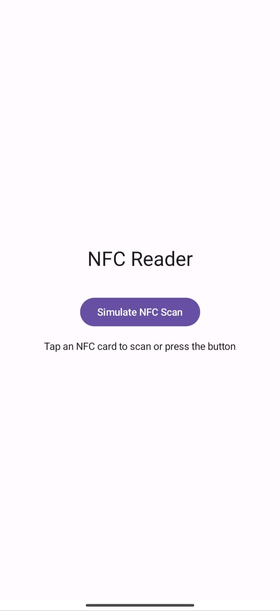

# NFC Reader App

## Overview
The **NFC Reader App** is an Android application built using **Kotlin** and **Jetpack Compose** to read and process NFC (Near Field Communication) tags. It allows users to scan NFC-enabled cards and view the extracted details, including card ID, type, and features. The app also includes a manual button to simulate an NFC scan without requiring a physical NFC tag.

## Features
- **Real-time NFC scanning** using Android's NFC API.
- **Jetpack Compose UI** with a clean and modern interface.
- **Manual NFC scan simulation** via a button for testing.
- **Location-based logging** (if enabled) to store NFC scan details.

## Technologies Used
- **Kotlin**
- **Jetpack Compose**
- **Android NFC API**
- **Location Services**

## Installation
### Prerequisites
- Android Studio (Latest version recommended)
- NFC-enabled Android device (for actual NFC scans)

### Steps to Run the App
1. Clone the repository:
   ```bash
   git clone https://github.com/your-username/NFCReaderApp.git
   cd NFCReaderApp
   ```
2. Open the project in **Android Studio**.
3. Sync the project with **Gradle** files.
4. Connect an NFC-enabled Android device or use an emulator (without NFC features).
5. Run the app on your device.

## Usage
### NFC Scanning
- Tap an **NFC-enabled card** on your device's NFC sensor.
- The app will automatically read and display the card details.

### Manual NFC Simulation (just for testing UI components and Firestore Integration)
- Press the **"Simulate NFC Scan"** button.
- It will generate a mock NFC tag scan with predefined card data.

## Screenshots
   

## Contributors
- **Syed Mohammad Ayaan** ([@ayaxan7](https://github.com/ayaxan7))

